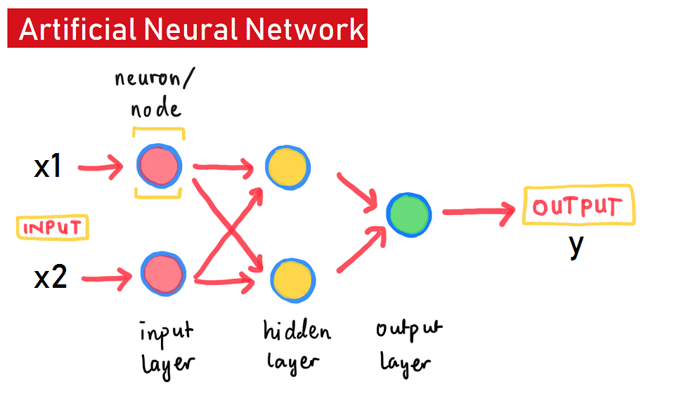
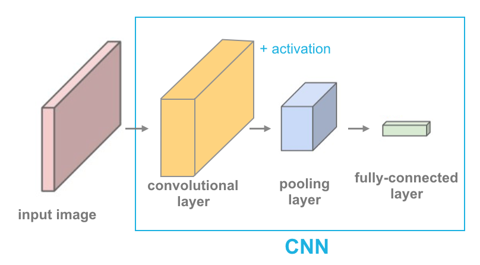
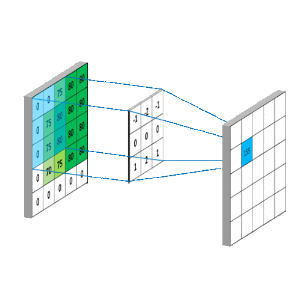

# Data Classification Using NN and Convolutional Neural Networks (CNN)

# Background

In this era, types of data are becoming more varied. Demand for processing raw voice data is increasing due to increased demand for sentiment analysis for improving services. This analysis can be used for example at customer services, finding music title, or improving sales through call centers. 

From these problems we will use audio data for creating machine learning model and one of the most popular and good method for working with unstructured data is using Convolutional Neural Network (CNN).

This material aims to provide an understanding for the workshop participants to classify audio data using Convolutional Neural Network (CNN). One Instructor and two Teaching Assistants will help participants troubleshoot or help with any difficulties encountered.

# Neural Network

A neural network, or artificial neural network (ANN), is a machine learning method inspired by how the human brain transmits information through the nervous system (biological neural network). There are two main components of a neural network: architecture and the learning process.

## Neural Network Architecture

The human nervous system consists of nerve cells called neurons, which are numerous and interconnected to form a network. Every stimulus/input from the environment is received by sensory organs as signals and then transmitted through neurons from one nerve cell to another.
    
> This neural network extends from the fingertips to the brain and back to the entire body. Information flows from the stimulus/input area, is processed in the brain, and then returned to the body as an output or response

Human Neuron  |  Artificial Neural Network's Neuron
-- | --
 | 

This neural system architecture is what inspired the development of neural network models.

---
# Convolutional Neural Network (CNN) 

Convolutional Neural Networks (CNNs) are widely used architectures for processing image data. However, as mentioned earlier, the processed audio data we have resembles image-like structures. This makes CNNs highly relevant for use in this context.  

## **Convolution Concepts**  
In the previous model, we learned how to classify song genres into different categories. However, there are some challenges:  

- When using dense layers, the number of parameters to be trained is very large.  
- The data used often contains irrelevant information, which does not improve the model but rather increases training time.  

What if we could extract only the relevant features and remove all unnecessary data? This would allow the network to work with a much lighter feature set while maintaining (or even improving) the amount of useful information. This is where **convolution** comes in.  

Based on the illustration, there are four different layers in a Convolutional Neural Network (CNN):

1. **Convolutional Layer**  
   - Extracts important features from the input data before passing them to the dense layer.  
   - Reduces the complexity of the data while retaining valuable information, making classification more efficient.

2. **Pooling Layer**  
   - Reduces the size of the data while preserving only the most relevant information (e.g., important pixels in an image or key frequency patterns in audio).  
   - Helps prevent overfitting by eliminating unnecessary details.

3. **Flattening Layer**  
   - Converts the multi-dimensional feature map into a one-dimensional array.  
   - Prepares the extracted features for input into the dense layers.

4. **Fully-Connected (Dense) Layer**  
   - A standard neural network layer used for classification.  
   - Uses the extracted and flattened features to make predictions.

### Convolutional Layer**  
A convolution extracts important information from the data using **filters**. These filters function similarly to real-world filters, designed for specific tasks and sensitive to particular patterns.  

For example, consider a **UV filter** for a camera lens. It blocks UV rays to reduce excessive blue tint from the sky. Similarly, CNN filters detect essential patterns in data while discarding irrelevant noise.  

Mathematically, the feedforward process in a convolutional neural network is called **"cross correlation"**.  
The term convolution comes from its derivative function when the network performs backpropagation.  

Below is an illustration and mathematical formula explaining how the network performs feedforward:

$$ F \circ I (x,y) = \sum_{j=-N}^{N} \sum_{i=-N}^{N} F(i,j) \times I(x+i, y+j)$$

